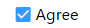
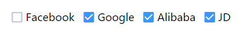

# gemini-checkbox
> A full-featured checkbox jquery plugin
##  Gemini Checkbox

### Features
+ Supports more configurable options.
+ Supports more methods
+ Supports more events
+ Supports fast internationalization
+ Cross-browser support

### Example image
##### Type: single

##### Type: group


### Getting started
#### Quick start
+ Clone the repository: git clone https://github.com/gregzhang616/gemini-checkbox.git.
+ Install with Npm: npm install gemini-checkbox.
+ Install with Bower: bower install gemini-checkbox.

#### Installation
##### Include files:
Css file
```
<link rel="stylesheet" href="/css/gemini.checkbox.min.css">
```
Javascript file
```
<script src="/assets/js/jquery.min.js"></script>
<script src="/js/gemini.checkbox.min.js"></script>
```
### Attributes
>You may set checkbox options with $().checkbox(options), the options type is Object.

| Name | Type  | Default value | Optional value | Description |
| :--- | :--- | :--- | :--- | :--- |
| name | String | '' | -- | native attribute for checkbox |
| checklist | String/Array | '' | -- | rendered data for checkbox, type is String or Array, such as 'Agree' or ['JD', 'Alibaba'] or [{label: 'JD', value: 1}, {label: 'Alibaba', value: 2}] |
| disabled | Boolean/Array | null | -- | disabled data for checkbox, such as true/false or ['JD'] or [1] |
| defaultValue | Boolean/Array | null | -- | default value for single checkbox or checkbox group. |
| size | String | 'small' | small/medium/large | The size for checkbox or checkbox group. |

### Methods
> Common usage

```
$().checkbox(methodName, argument1, argument2, ..., argumentN);
```
##### setValue(value)
Set the current value with a new value, parameter value type is Boolean or Array .
```
$().checkbox('setValue', true);
$().checkbox('setValue', ['JD', 'Alibaba']);
$().checkbox('setValue', [1, 2]);
```

##### getValue()
Get the current checked value.
```
$().checkbox('getValue');
```

##### clear()
Clear the checkbox checked status.
```
$().checkbox('clear');
```

##### disable(value)
disable or enable the picker, if parameter value is true that can disable the picker, otherwise can enable the picker.
```
// disable the single checkbox
$().checkbox('disable', true);
// enable the single checkbox
$().checkbox('disable', false);

// disable the checkbox group item
$().checkbox('disable', ['JD', ...]); or $().checkbox('disable', [1, ...]);
// disable the all the checkbox item
$().checkbox('disable'); 
// enable the all the checkbox item
$().checkbox('disable', []);
```

##### destroy()
Destroy the checkbox and remove the instance from target element.
```
$().checkbox('destroy');
```

### Events
> Common usage

```
$().on(eventName, function (e, arguments) {
  // todo
});
```

##### change.checkbox
This event fires when checked value is changed.
* event ( Type: Object )
  * newValue ( Type: Boolean/Array )
  
```
$().on('change.checkbox', function (event) {
  console.log('newValue: ' + event.newValue);
});
```

##### check.checkbox
This event fires when checkbox item is clicked.

```
$().on('check.checkbox', function (e) {
  // todo
});
```

### Callbacks
> Common usage

```
$().datepicker({
    CallbackName: function () {
      // todo
    }
});
```
##### onChange
A shortcut of the "change.checkbox" event, this callback called when checked value is changed.

```
$().checkbox({
    onChange: function (event) {
      console.log('newValue: ' + event.newValue);
    }
});
```

##### onCheck
A shortcut of the "check.checkbox" event, this callback called when checkbox item is clicked.

```
$().checkbox({
    onCheck: function () {
      // todo
    }
});
```

### Run example
> Please download the project, and then enter into this directory.(download gulp-sass plugin need to connect vpn)

+ npm install
+ gulp
+ Access "http://localhost:8888/examples/index.html" in browser

### Browser support
* Chrome Most versions
* Firefox Most versions
* Safari Most versions
* Opera Most versions
* Edge Most versions
* Internet Explorer 8+

### Author
Greg Zhang from Asiainfo (gregzhang616@gmail.com).
